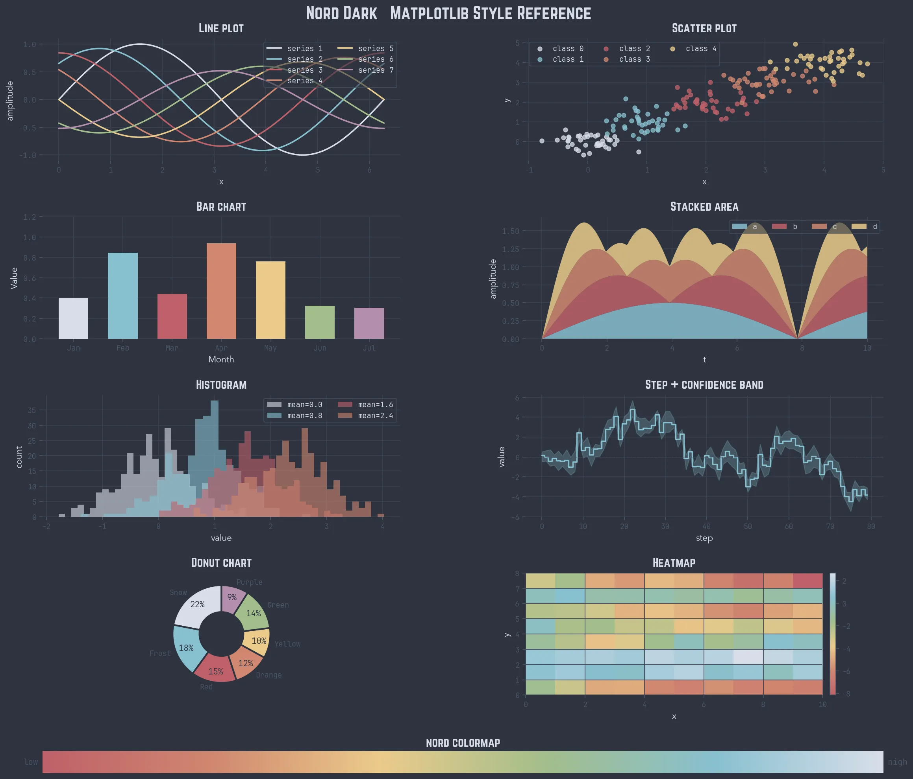

# nordmpl

A [Nord](https://www.nordtheme.com/) Dark colour theme for [Matplotlib](https://matplotlib.org/).



---

## Installation

```bash
pip install git+https://github.com/daniilhayrapetyan/mpl-nord-style.git
```

Requires Python ≥ 3.9, Matplotlib ≥ 3.6, and NumPy.

---

## Usage

```python
import nordmpl
nordmpl.set()

import matplotlib.pyplot as plt

fig, ax = plt.subplots()
ax.plot([1, 2, 3], [1, 4, 9])
ax.set_xlabel("x")
ax.set_ylabel("y²")
plt.show()
```

That's it. Fonts, colours, grid, colormap — all applied automatically.

### Norwester titles

`nordmpl.set()` hooks into Matplotlib so fonts are applied when axes are
created. To additionally set a title in the **Norwester** typeface:

```python
nordmpl.apply(ax, title="My chart")
```

### Colour palette

All Nord colours are available directly on the package:

```python
nordmpl.AURORA_RED    # "#BF616A"
nordmpl.FROST_2       # "#88C0D0"
nordmpl.CYCLE         # ordered colour list used in prop_cycle
```

### Colormap

The `"nord"` colormap (Aurora Red → Snow) is registered as the default
`image.cmap`. Access the object directly with `nordmpl.cmap`, or use
`"nord_r"` for the reversed direction.

```python
ax.imshow(data, cmap="nord_r")
```

---

## Example

A full style reference covering line, scatter, bar, stacked area, histogram,
step, donut, heatmap, and colormap plots is in
[`example.py`](example.py).

Run it to regenerate the preview:

```bash
python example.py
```

---

## Fonts

The following fonts are bundled and registered automatically by `nordmpl.set()`:

| Role | Font |
|---|---|
| Tick labels | JetBrains Mono Light |
| Axis labels | Avenir LT Std |
| Titles (`nordmpl.apply`) | Norwester |
